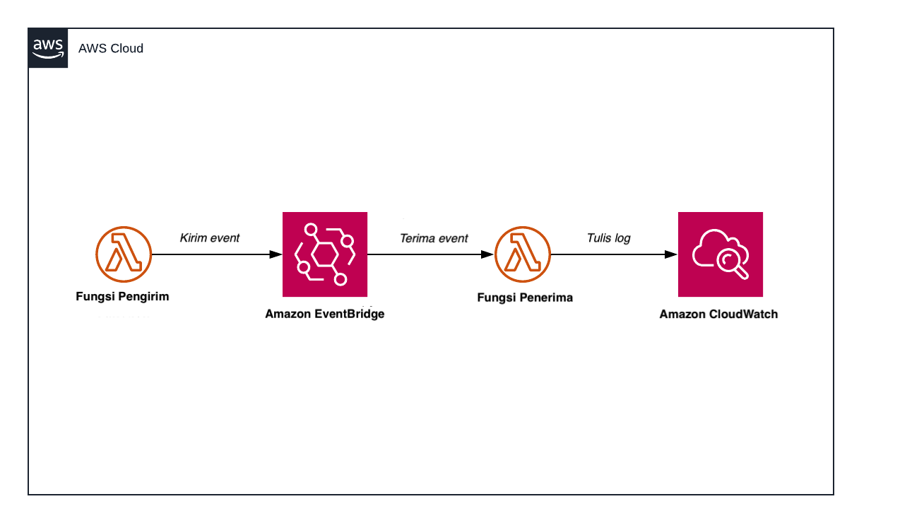

# Lab 1: Pengiriman dan Penerimaan Dasar
[English](README.md) | [Bahasa Indonesia](README-id.md)

Dalam _workshop_ ini, Anda akan membangun 2 fungsi AWS Lambda. Satu fungsi AWS Lambda (sebagai _producer_) akan mengirimkan (_dispatch_) _event_, dan satu Fungsi AWS Lambda (sebagai _consumer_) akan menerima (_consume_) _event_. Selain menerima _event_, Konsumen juga akan menulis log ke AWS CloudWatch Logs untuk memastikan aliran prosesnya berjalan dengan baik.

## Diagram


## Tugas
Ini adalah tugas-tugas yang harus Anda kerjakan. Jika Anda mengalami kebingungan, silakan rujuk referensi utama di folder `source/`.

### Langkah 0: Persiapkan folder `work` dan boto3
#### Install _library_ boto3
- Buka terminal
- Jalankan perintah berikut
```bash
pip install boto3
```

#### Persiapkan folder `work`
- Masuk ke folder `work/`
- Anda akan menemukan 2 subdirektori dengan nama `cdk` dan `lambda-functions`
- Masuk ke `work/lambda-functions/`
- Anda akan menemukan 2 subdirektori lagi dengan nama `consume-function` dan `dispatch-function`

### Langkah 1: Buka file Pengirim (_Producer_)
- Masuk ke `work/lambda-functions/dispatch-function/`
- Buka `app.py`
- Baca file tersebut secara menyeluruh, karena mulai dari langkah berikutnya Anda akan bekerja pada file ini

### Langkah 2: Mengirim _event_
- Tambahkan kode untuk mengirim _event_ ke Amazon EventBridge dengan info sebagai berikut:
    - Source: lab1-bdc-dispatch
    - DetailType: message-received
    - Detail: [harus dalam format JSON]
		```json
		{"title":"This is a test message", "test": true} 
		```
    - EventBusName: < dapatkan informasi ini dari _environment variable_ bernama "EVENT_BUS_NAME" >

> **💡 PETUNJUK**
> - Anda memerlukan sebuah _client_ untuk terhubung ke sumber daya AWS. Pada Python, Anda perlu menggunakan _library_ boto3
> - Gunakan API put_events() untuk mengirim _event_ ke Amazon EventBridge. Berikut ini [tautannya](https://boto3.amazonaws.com/v1/documentation/api/latest/reference/services/events.html)

> ### 😕 Anda kebingungan?
> Lihat solusinya [di sini](https://github.com/donnieprakoso/workshop-eventDrivenMicroservices/blob/master/1-lab-basicDispatchConsumeEvent/source/lambda-functions/dispatch-function/app.py)

### Langkah 3: Buat Penerima (_Consumer_) dengan AWS Lambda
- Masuk ke `work/lambda-functions/consume-function`
- Buka `app.py`
- Catat dan kirim variabel `event` ke Amazon CloudWatch Logs

> **💡 PETUNJUK**
> - Perintah Python `print` ketika dijalankan di dalam fungsi AWS Lambda akan mengirim output ke Amazon CloudWatch Logs

> ### 😕 Anda kebingungan?
> Lihat solusinya [di sini](https://github.com/donnieprakoso/workshop-eventDrivenMicroservices/blob/master/1-lab-basicDispatchConsumeEvent/source/lambda-functions/consume-function/app.py)

### Langkah 4: Buat sebuah aplikasi AWS CDK
- Masuk ke `work/cdk`
- Buat sebuah file dengan nama `cdk.json`
- Buka `cdk.json` dan tuliskan baris-baris berikut. Baris-baris ini akan memberi instruksi untuk AWS CDK tentang cara membangun aplikasi ini
```json
{
	"app":"python3 app.py",
	"context":{}
}
```
- Buka `app.py`. Di dalam file ini, Anda akan menemukan bahwa ada beberapa hal yang perlu kita tambahkan untuk membuatnya menjadi set kode yang lengkap. Baca file ini secara menyeluruh dan lakukan langkah-langkah berikutnya di bawah

### Langkah 5: Definisikan pola dan _construct_ Amazon EventBridge
- **Anda tidak perlu melakukan apa pun.** Bagian ini sudah disediakan di dalam file `app.py`

### Langkah 6: Definisikan IAM Permissions
- **Anda tidak perlu melakukan apa pun.** Bagian ini sudah disediakan di dalam file `app.py`

### Langkah 7: Definisikan fungsi AWS Lambda yang berperan sebagai Pengirim
- **Anda tidak perlu melakukan apa pun.** Bagian ini sudah disediakan di dalam file `app.py`

### Langkah 8: Definisikan fungsi AWS Lambda yang berperan sebagai Penerima
- **Anda tidak perlu melakukan apa pun.** Bagian ini sudah disediakan di dalam file `app.py`

### Langkah 9: Definisikan Amazon EventBridge Rule
- Anda harus mendefinisikan Amazon EventBridge Rule dan mengaitkannya dengan _constructs_ / sumberdaya yang terkait.
- Berikut adalah atribut detail yang perlu Anda masukkan:
    - enabled: True (jika nilainya False, maka Rule ini akan dinonaktifkan)
    - event_bus: eb (harus menambahkan rujukan ke variabel `eb`)
    - event_pattern: eb_pattern (harus menambahkan rujukan ke variabel `eb_pattern`)
    - targets: (harus menambahkan rujukan ke variabel `fnLambda_consume`)

> **💡 PETUNJUK**
> - Membuat definisi Amazon EventBridge Rule cukup mudah. Berikut ini [tautan](https://docs.aws.amazon.com/cdk/api/latest/python/aws_cdk.aws_events/Rule.html) referensi API terkait 
> - Jangan lupa tambahkan Target ke Rule ini. Amazon EventBridge menyediakan integrasi dengan berbagai layanan AWS. Berikut ini [tautan](https://docs.aws.amazon.com/cdk/api/latest/python/aws_cdk.aws_events_targets/LambdaFunction.html) referensi API  untuk menambahkan fungsi AWS Lambda sebagai Target

> ### 😕 Anda kebingungan?
> Lihat solusinya [di sini](https://github.com/donnieprakoso/workshop-eventDrivenMicroservices/blob/master/1-lab-basicDispatchConsumeEvent/source/cdk/app.py)

### Langkah 10: Tandai (_Tagging_) aplikasi AWS CDK Anda
- Masih di file `app.py`, tambahkan baris-baris berikut untuk menandai aplikasi AWS CDK Anda
```python
app = core.App()
stack = CdkStack(app, "Lab1-BasicDispatchConsume")
core.Tags.of(stack).add('Name','Lab1-BasicDispatchConsume')
app.synth()
```

### Langkah 11: Install semua _library_ yang dibutuhkan untuk membangun aplikasi CDK
- Masuk ke `work/cdk/`
- Buat sebuah file dengan nama `requirements.txt`. Ini adalah metode standar untuk menginstall _libraries_ yang dibutuhkan untuk aplikasi Python
- Tuliskan baris-baris berikut:
```
aws-cdk.core==1.70.0
aws-cdk.aws-lambda==1.70.0
aws-cdk.aws-iam==1.70.0
aws-cdk.aws-events==1.70.0
aws-cdk.aws-events-targets==1.70.0
```
- Install _libraries_ yang dibutuhkan dengan menjalankan perintah berikut di terminal:
```bash
pip3 install -r requirements.txt
```

### Langkah 12: Deploy
- Buka terminal dan pindah ke `work/cdk/`
- Deploy aplikasi dengan menjalankan:
```bash
cdk deploy
```

### Langkah 13: Pengujian
- Masuk ke [dashboard](https://ap-southeast-1.console.aws.amazon.com/lambda/home) AWS Lambda
- Pastikan Anda berada di region AWS yang sama dengan yang region yang Anda pilih saat mendeploy aplikasi
- Cari fungsi Lambda **Pengirim**. Untuk menyaring berdasarkan nama fungsi, Anda bisa mengetik "BasicDispatchConsume" pada kotak pencarian
- Klik tautan yang akan membawa Anda ke fungsi AWS Lambda pengirim

#### Menjalankan Fungsi Pengirim
Sekarang kita akan menguji fungsi Pengirim yang akan mengirim sebuah _event_ ke Amazon EventBridge. Fungsi penerima akan mengkonsumsi _event_ ini dan juga mencatatnya sebagai log ke Cloudwatch.

- Klik tab **Test** untuk masuk ke halaman **Test**
- Di halaman pengaturan Test event, pilih **Create new test event** dan di bagian Event template, biarkan pilihan standar Hello World
- Masukkan nama event di kolom Event name dan tuliskan templat kosong:
```json
{}
``` 
- Klik **Save changes** lalu klik lagi tombol **Test**

#### Ayo periksa log di Amazon CloudWatch Logs
- Masuk ke [dashboard](https://ap-southeast-1.console.aws.amazon.com/cloudwatch/home) Amazon CloudWatch Log groups
- Cari log untuk fungsi Lambda **Penerima**. Untuk menyaring berdasarkan nama Log group, Anda bisa mengetik "BasicDispatchConsume" pada kotak pencarian
- Cari dan buka Log Stream terbaru
- Jika Anda melihat ada sebuah JSON dengan data dari _event_ yang dikirim oleh fungsi **Pengirim** melalui Amazon EventBridge, maka Anda telah menyelesaikan _workshop_ ini


# 🤘🏻 Selamat! 
Anda telah menyelesaikan Lab 1

## Pembersihan
Untuk menghapus semua sumber daya, ikuti instruksi-instruksi di bawah:
1. Masuk ke `work/cdk/`
2. Jalankan perintah `cdk destroy`
```bash
cdk destroy
```